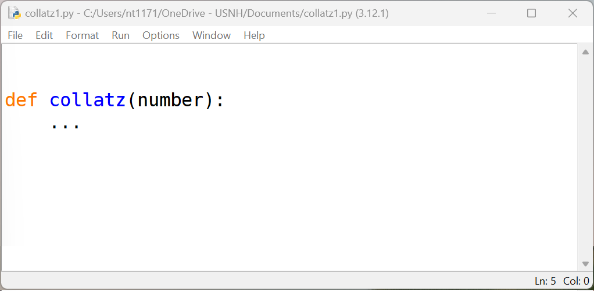
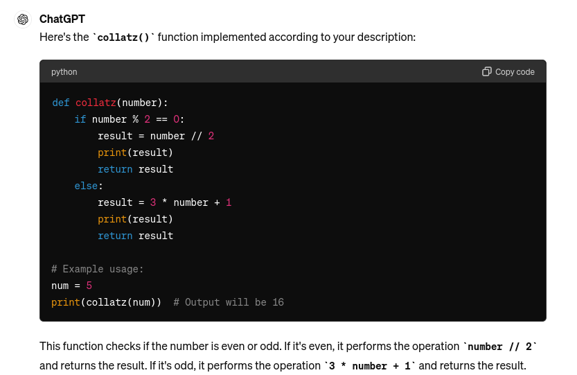
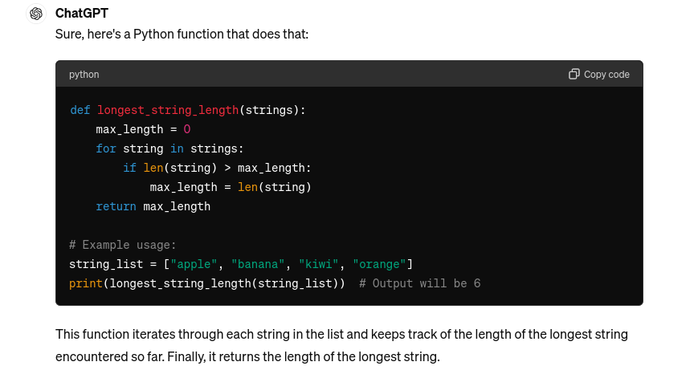
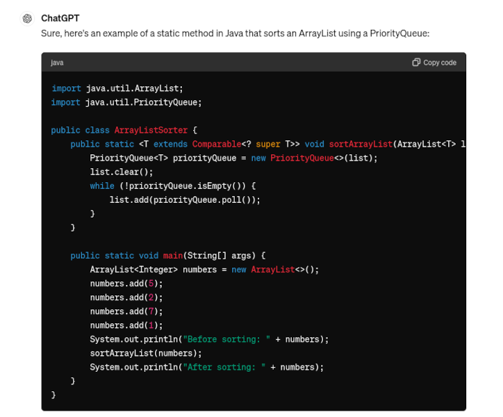
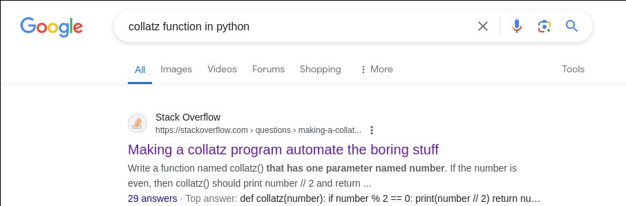
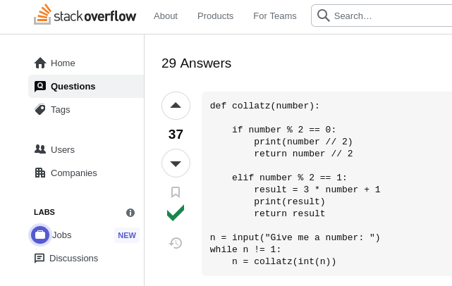

## Programming without Google

Nat Tuck

March 14, 2024

---

### In this presentation

 - I will explain a well known problem
 - And the obvious solution

No refunds on the 15 minutes of your time.

---

### Last Fall

A new task for me:

 - Teach a low level programming course
 - Using a popular programming language

Elman Bashar warns: ChatGPT is our #1 enemy.

---

### Two Courses

 - Last fall and this spring:
   - Data Structures and Intermediate Programming (in Java)
 - This spring also:
   - Intro to Programming (in Python)
 - Both courses have the same structure and the same issue

---

### Standard Plan

 - We have a two hour lab block
 - Students start their weekly problem set in lab
 - Finish at home
 - Problem set is due the night before the next lab block

---

### Sample Task

 - Read a chapter of the textbook.
 - [Do the first practice project ](
https://automatetheboringstuff.com/2e/chapter3/#calibre_link-149)

---

Plan A: Actually do the thing

--- 

Plan B: Hey [ChatGPT](https://chatgpt.com/)

**In Python,** Write a function named collatz() that has
one parameter named number. If number is even, then collatz() should
print number // 2 and return this value. If number is odd, then
collatz() should print and return 3 * number + 1.

---

---

Maybe that one was too easy. Hey [ChatGPT](https://chatgpt.com/)

In Python, write a function that takes a list of strings and returns
hte length of the longest string in the list.

---

---

How about my Data Structures class? Hey [ChatGPT](https://chatgpt.com/)

In Java, write a static method that uses a priority queue
to sort an ArrayList.

---

---

 - Everyone's complaining about ChatGPT right now.
 - So this is a new problem, right?

Hey [Google](https://google.com)

collatz function in python

--- 

---

---

### Solution #1

Don't reuse problems.

There just aren't that many short functions that take and return an
integer.

---

### Solution #2

"They'll get to use the web in the real world, let them do it now."

 * This is the course topic
 * Like calculators when teaching arthmetic

---

### Solution #3

Use an obscure programming language for intro courses.

 * My previous institution used an in-house language
 * Tradeoffs; not a long term solution

---

### Solution #4

Ban web resources

 * Difficult for homework.
 * Plausible during the lab block

That's what I tried this Spring.

---

### Lab Web Rules

Allowed:

 - Course Website
 - Textbook
 - Official documentation
 
Not allowed:

 - Search engines
 - AI
 - Discussion / Q&A resources

---

### Complications

 - Assignments needed to be shortened to fit in lab block.
   - About half as long as old labs
 - Requires active proctoring.
   - Took a couple weeks for students to believe "no Google"

---

### Results

 - This worked great.
 - I'm going to keep doing it.

---

### Future

 - I had small classes, proctoring may be hard to scale.
 - Better: 
   - Having the lab computers (partially?) offline
   - Local resources only or only allowed resources
   - Might try that in the fall

---

### Questions / Thoughts?

 - Slides and contact info at [https://slides.homework.quest/](
   https://slides.homework.quest)
